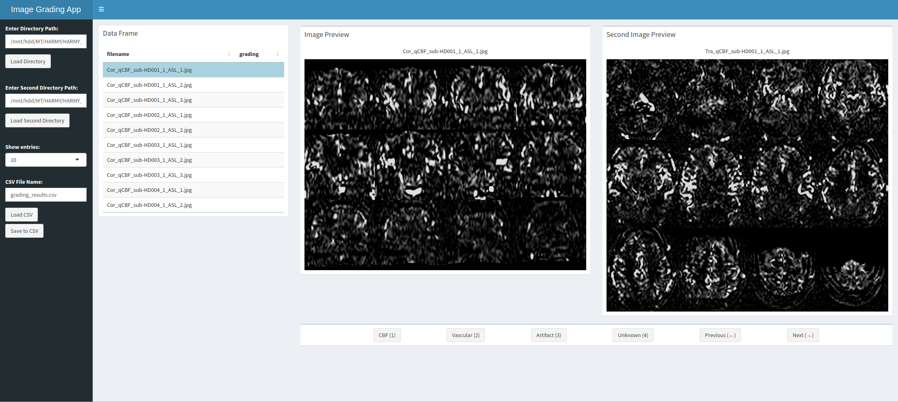

# ExploreASL-Tools

Here are some scripts that help in managing some pre- and post-processing from ExploreASL.
Feel free to use any of the scripts to help in your workflow!

## check_processing_status.sh
ExploreASL will include a "999_ready.status" found in the lock folder. This script will search for this status and report if any of the subjects are without this status.
### Current limitations
* If the subject did not begin processing in the specific module, it will fail to detect it. So, do a check if your subject list matches your raw data.

Example usage: ```./check_processing_status.sh /path/to/module_locked_folder```

## find_missing_rawdata.sh
This script will help report the subj with the missing files you are looking for. For example, if you are looking for subjects with missing "\*run-1\*". This will loop through all your folders and look for the specific string indicated. You can repeat this for either the 'anat' or 'perf' folder by supplying the argument to the script. 
Example usage: ```./find_missing_rawdata.sh /path/to/rawdata anat "*filename_pattern*"```

## moving_dicoms_to_subj_root.sh
ExploreASL import relied on sourcestructure.json to detect DICOMs for conversion. As the folder hierarchy is fixed based on what was defined in sourcestructure.json, this can fail to detect subjects with different folder depths. This script will help you move your defined folders to the subj root folder.
Example: ```./moving_dicoms_to_subj_root.sh /path/to/sourcedatafolder scans```

## QC.R and QC_TwoPanel.R
This runs in R Shiny. To facilitate the QC process, you can provide the path to the JPEGs generated by ExploreASL and conduct your QC on the Shiny interface. This script allows QC to be conducted using just your keyboard keys (1- CBF, 2- Vascular, 3- Artefact, 4- Unknown). Using the left and right keys, you can further revisit your previous image to change your gradings. Once you are ready to export, you can click "Save to CSV", and it will generate a CSV file in the same folder as your images. Windows can be resized according to the size you prefer. This Shiny app also features a way to reload your CSV file to resume from where you stopped. Ensure your CSV file is correctly entered and located where the first panel directory is. Click "Load CSV" to resume. 

Recommended for two-panel function: First, group all your Coronal and Transverse images into separate folders. Then, these two paths are used as the directory paths to load the images. The CSV will always be saved to the first directory loaded.

### Steps to Get Started
1) Load the first directory
2) Load the second or third directory (optional)
3) Check if both images match (optional, if you did not load the second panel)
4) Load csv file (optional, if you do not have a previously graded csv saved)
5) Start grading, either using the mouse or the keyboard. 

### New Features Added
- Load of previous grading from csv file with past gradings (limitations: needs to ensure that it is the right csv file)
- Added prompts when you are trying to load the path to avoid accidental refresh.
- Added a field to name your CSV export file and prompts to warn about overwriting existing files.
- Added additional version (QC_TwoPanel.R), which allows you to scroll through two views concurrently. Preload your images into two folders and provide the paths accordingly. Ensure that each folder has the same subjects' images. CSV file path will always take reference from the first directory loaded
- Added a counter to inform the number of images left to grade
- Added comment field to provide additional information about the image when needed. 



### Current limitations
* No dropdown to select the specific image without scrolling through all subjs, but it doesn't take too long to scroll using the keys at this moment.
* Two-panel will not know if images mismatch between sessions or subjects, so make sure to check your images before your screening.
